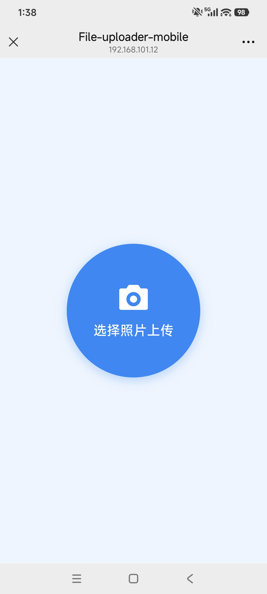
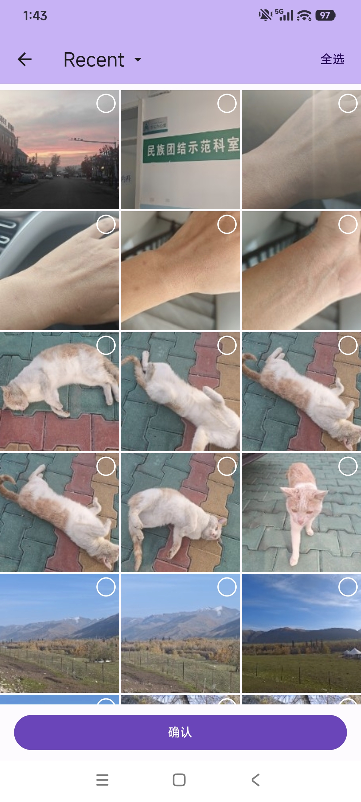
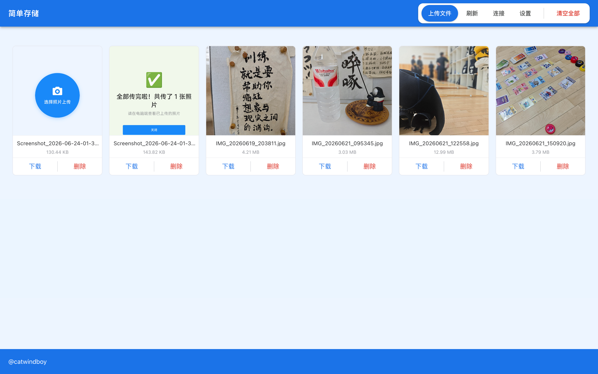
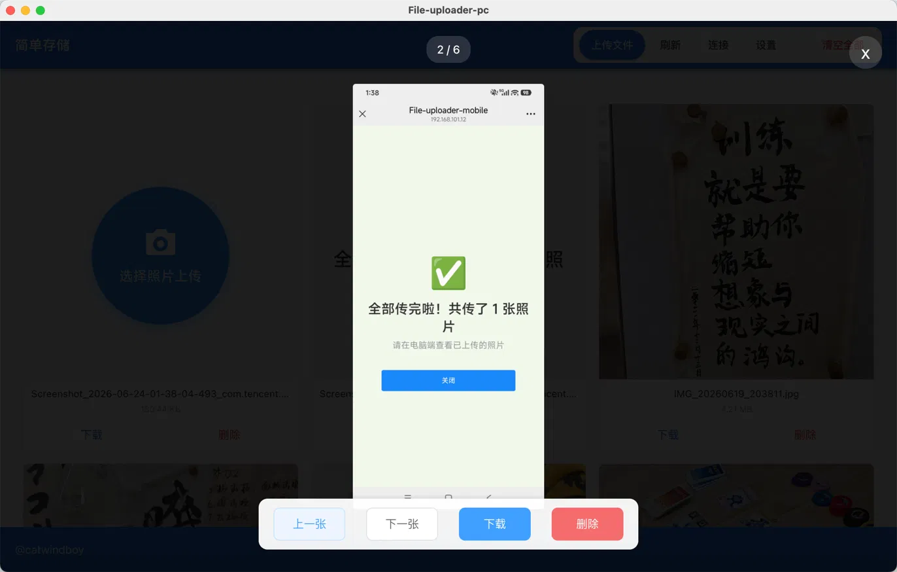

# 简单存储 (file-uploader)

局域网照片/文件传输工具 —— PC 上打开，手机扫码，点一个大按钮，传完。

专为"帮完全不懂技术的家人（AKA：我妈）传照片"这个场景设计。

---

## 这个项目为什么存在

传文件的工具很多，但没有一个能让我妈独立用起来。

她眼神不太好，输东西比较慢；不会在电脑上装运行环境，面对我给她老人家留下的一长串截图和文字说明完全是看天书。也试过一些市面上的传输工具，要么操作复杂（需要手机开启开发者模式）、要么一堆弹窗广告（老太太总点错）、要么就是收费。

所以这个项目的每一个设计，都是围绕"如何让一个七十岁的老人家可以方便的把照片从手机里传到电脑里"来做的，方向只有一个字：**简化**。

- 砍掉登录、用户、鉴权 —— 局域网内可信，不需要
- 砍掉手动输网址 —— PC 端直接生成二维码，手机扫码直达
- 砍掉环境部署 —— 桌面版把服务端和页面打包进一个 App，双击即用
- 砍掉 mobile 端一切多余交互 —— 只留一个超大的"点击上传"按钮
- 补上 Web 做不到的批量选图 —— 安卓 App 调系统相册，支持按日期全选、按文件夹全选、一键全选；服务端做了自动去重，选多了也没关系。

---

## 截图

**手机端：扫码打开就一个按钮，点一下选图。安卓 App 调起系统相册，可一键全选。**

| ① 点这一个按钮 | ② 原生相册多选 / 全选 |
|---|---|
|  |  |

**PC 端：手机传上来的照片，在电脑上即时浏览，点开看大图、翻页、下载、删除。**

| ③ 网格总览 | ④ 大图查看 + 翻页 |
|---|---|
|  |  |

> 内建图片查看器，翻页 / 下载 / 删除一气呵成，不必依赖系统自带的看图工具。
> PC 端也可直接用浏览器访问（`http://<PC的IP>:38903/pc`），功能与桌面版基本一致，仅桌面版额外支持自定义存储位置。

---

## 它是怎么工作的

```
┌────────────────────────────┐         ┌──────────────────────────┐
│   PC（桌面 App / 浏览器）    │         │     手机                  │
│                            │         │                          │
│  ① 启动后显示访问二维码      │  扫码    │  ② 扫码直达上传页         │
│  ④ 实时浏览、预览、管理照片  │ ◄─────► │  ③ 点一个大按钮，选图上传  │
│                            │  局域网  │     （安卓 App 可原生全选）│
└────────────────────────────┘         └──────────────────────────┘
```

照片最终落在 PC 本地（SQLite 记录 + 文件归档），不经过任何云、不联外网。
照片移动了也没关系，本来就是做一次性上传的；存储位置会按照日期建立次级文件夹进行归档。

---

## 四个子项目

这是一个单一仓库，包含协同工作的四端：

| 目录 | 角色 | 技术栈 |
|------|------|--------|
| [`file-uploader-server`](./file-uploader-server) | 后端服务：接收上传、存储、提供管理 API | NestJS + Prisma + SQLite |
| [`file-uploader-fe`](./file-uploader-fe) | 前端页面：PC 端浏览 + 手机端上传（同一套，多页隔离） | Vue 3 + TS + Vite |
| [`file-uploader-desktop`](./file-uploader-desktop) | 桌面壳：把后端 + 前端打包成双击即用的 App | Electron |
| [`file-uploader-app`](./file-uploader-app) | 安卓 App：扫码 + WebView + 原生相册批量选图 | Flutter |

每个子目录有各自的 README，讲该端的技术细节与单独启动方式。

---

## 我该用哪个？

**只想给家里人用 → 桌面版就够了。**
桌面版（Electron）把后端和页面打包在一起，双击运行，无需任何配置。家人手机扫码即可上传。

> 📦 桌面版目前需自行打包（见 [`file-uploader-desktop`](./file-uploader-desktop)）。
> 预编译安装包会陆续上传到 [Releases](../../releases)：macOS 优先，Windows 开发中。
> 手机端如需"按日期批量选图"，可装安卓 App（见 [`file-uploader-app`](./file-uploader-app)）；不装也能用浏览器扫码逐张传。

**想自己跑源码 / 二次开发 → 看下面。**

---

## 从源码运行（开发者）

我的环境：
- Node.js 22+
- Flutter 3.7.0

> 安卓 App 目前基于较旧的 Flutter 3.7.0 开发，在新版本下可能需要适配，正在升级稳定中。

```bash
# 克隆整个仓库
git clone <repo-url>
cd file-uploader
```

四端可独立启动，最小可用组合是 **server + fe**：

```bash
# 1) 启动后端（默认 :38902）
cd file-uploader-server
npm install
npm run prisma:migrate
npm run start:dev

# 2) 另开一个终端，启动前端（默认 :38903）
cd file-uploader-fe
npm install
npm run dev
```

打包桌面版、构建安卓 App 的步骤，分别见 [`file-uploader-desktop`](./file-uploader-desktop) 和 [`file-uploader-app`](./file-uploader-app) 的 README。

---

## 关于开发方式

本项目使用 [OpenSpec](https://github.com/Fission-AI/OpenSpec) 进行 spec-driven 开发，各子目录的 `openspec/` 下保留了完整的提案演进记录——包括一些早期的、后来被简化或推翻的方案。它们记录的是真实的设计取舍过程，和一些睿智的拍脑袋决定。

---

## 安全边界

**所有端点默认不带鉴权**，设计前提是"局域网内可信"。

适用：单机桌面使用、家庭/办公室局域网（可信内网）。
不适用：直接暴露到公网。若需公网访问，请在上游网关层自行加鉴权（nginx basic-auth、Cloudflare Access、Tailscale 等）。

---

## License

[MIT](./LICENSE) © 2026 杨
